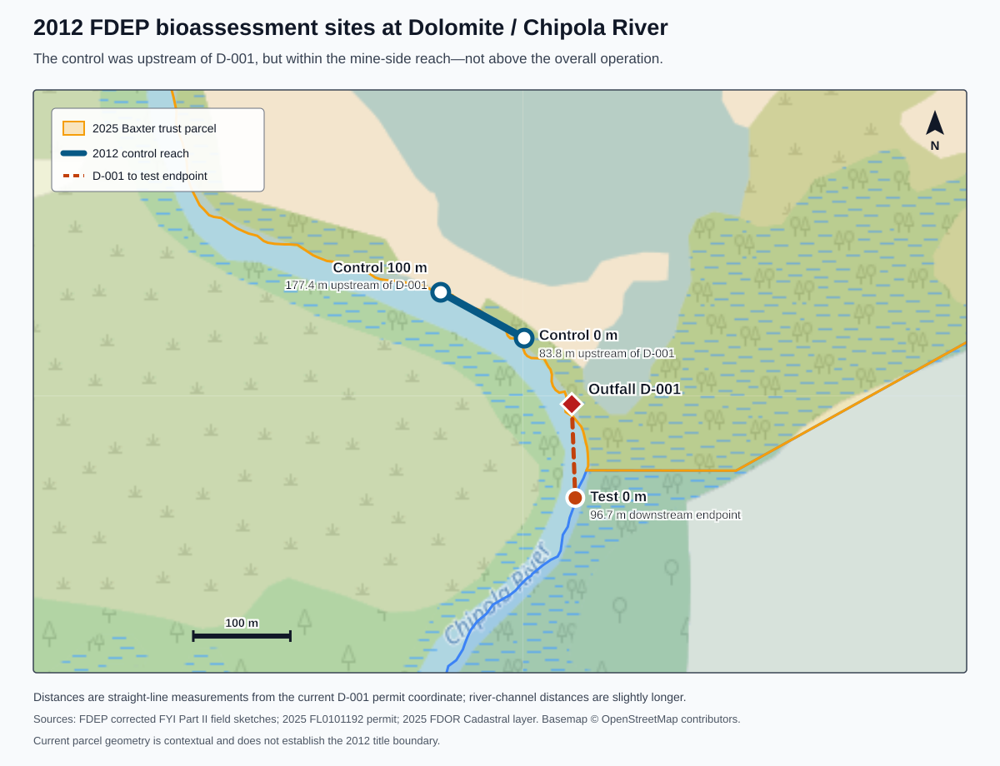

# Chipola River / Dolomite–Rocky Creek Mine deep dive

**Research date:** September 1, 2026
**Last updated:** September 2, 2026<br>
**Site:** Dolomite, Inc. / Rocky Creek Mine and Mill, 1321 Highway 71, Marianna, Jackson County, Florida
**Primary waterbody:** Chipola River, WBID 51D
**Primary regulatory identifiers:** NPDES **FL0101192**; Mining/ERP **MMR_215039 / ERP_215039**; EPA FRS **110006778488**

## Bottom line

There is a real, permitted industrial point source from this mine to the Chipola River. It is **Outfall D-001**, a current 48-inch reinforced-concrete culvert at approximately **30.647289, -85.176478**. The mining lake drains through settling/turbidity controls and this culvert directly into the river. The industrial wastewater permit allows up to a **9.7-million-gallon-per-day design flow**, although the permit does not impose a numeric flow cap and the July 2026 reported average was 2.96 MGD.

**No reviewed public agency finding, laboratory result, or indexed incident report proves that the mine caused the reported fish, reptile, or alligator deaths.** The defensible conclusion is narrower: the facility is a high-priority source to investigate immediately because it has a direct discharge; installed two new internal outfall structures and a new spillway leading toward the existing river discharge in early 2026; and received an April 29, 2026 FDEP warning concerning disturbance inside the Chipola River buffer and inadequate best-management practices. Those facts establish an investigation pathway, not causation.

The latest publicly available DMR—July 2026—reported no permit-limit exceedance. But it represents only **one monthly grab sample** for the parameters that matter to compliance: flow, turbidity, total suspended solids, and pH. It did **not** routinely test dissolved oxygen, temperature, ammonia/nutrients, metals, petroleum compounds, pesticides, blasting residues, cyanotoxins, or whole-effluent toxicity. A short-lived toxic, oxygen-depleting, or storm-driven pulse could therefore occur between compliant monthly grabs.

The state’s final 2024–2026 assessment, posted August 17, 2026, changes the older impairment story. In WBID 51D, **mercury in fish tissue remains impaired, Category 4a, with a TMDL complete**. FDEP now classifies the earlier biological and total-nitrogen listings as **Category 2 / not impaired** and asks EPA to remove them from the federal 303(d) list. Many metals and pesticides are Category 3b—**insufficient data**—rather than demonstrated clean. The mercury listing is a chronic fish-consumption issue and is not a plausible explanation by itself for a sudden multi-species mortality event.

The largest information gap is acute-event sampling. The federal Water Quality Portal contains **no surface-water results within five miles of D-001 from 2020 forward**; the only results returned in that radius are groundwater records. The most recent broad chemistry located for the actual outfall was an FDEP compliance sample on January 24, 2022. The latest spot inspection at D-001 was December 4, 2023. Neither can resolve a 2026 mortality event.

The aerial site context identifies **Arcosa Aggregates immediately downstream**. FDEP’s Nexus/OCULUS successor records independently confirm North Florida Rock/Arcosa under industrial wastewater permit **FL0980722**, mining file **MMR_173508**, and multisector stormwater coverage **FLR05I752**. FDEP documented an actual/natural Chipola connection at its industrial D-001 route in March 2024, and the stormwater facility record separately describes an outfall “to CHIPOLA RIVER.” The public file therefore supports a two-operation, cumulative-source investigation. It does not show that Arcosa—or Dolomite—caused the reported mortality.

## 1. The physical site and its discharge routes

### Current permitted route to the Chipola

The facility mines limestone/dolomite by boring, blasting, and wet dragline excavation. Rock is stockpiled/dewatered, trucked roughly 2,200 feet to the processing area, crushed, dry-screened, and washed. Rock-wash water, fines, and stormwater are routed through sedimentation ponds, reused, and then sent to an old quarry that the current permit describes as having no discharge.

A separate man-made mining lake is the source of the river discharge:

```text
active wet mine / mining lake
          |
          v
narrow channel -> final sedimentation lake
          |
          +-> three riprap turbidity barriers + floating barrier
          |
          +-> new 2026 internal structures OFS-1 and OFS-2 / Spillway 6
          |
          v
48-inch RCP, permitted Outfall D-001
          |
          v
Chipola River (WBID 51D, Outstanding Florida Water)
```

The 2026 ERP construction plans place **OFS-1 and OFS-2** at the southern end of the lake, using 24-inch HDPE, and show **Spillway 6** near the existing 48-inch reinforced-concrete pipe to the Chipola. These are internal mining/stormwater structures feeding the existing discharge system; D-001 remains the legally identified surface-water point source under FL0101192.

### The second, historically troublesome route: Rocky Creek

The western/old-quarry side of the property historically drained to Rocky Creek, which then joins the Chipola. That route has a repeated compliance history:

- In October–December 1999, FDEP documented a continuous, unpermitted discharge from the old quarry to Rocky Creek. The only approved surface-water discharge was then D-001 to the Chipola. The 1997 renewal application had not disclosed the Rocky Creek point.
- A January 20, 2000 site visit found spring-fed old mine lakes receiving stormwater that contacted stored dolomite. Water traveled from Basin 5 through the lakes to Rocky Creek. Inspectors thought the unpermitted flow appeared greater than the permitted D-001 flow. They also concluded that the permit application’s claimed routing to D-001 was physically implausible because lake banks were too high.
- The permit was later revised to recognize D-002, with discharge allowed only after a greater-than-25-year/24-hour storm and without routine monitoring. An earthen dam was built; a January 2003 inspection found no outward flow except potential flooding conditions.
- In 2015, FDEP again found wash water entering the old quarry and then Rocky Creek while bypassing the authorized D-002 arrangement. Corrective structures, a revised site plan, BMP updates, and turbidity controls followed.
- Current plans label the old Rocky Creek discharge as “eliminated in 2014” and depict three dams separating affected mine/stormwater areas from Rocky Creek. Because the route recurred after earlier correction, those dams and any overflow/bypass points deserve event-window inspection.

This history matters because a mortality plume could reach the Chipola by either the direct D-001 route or Rocky Creek. Sampling only the main culvert would leave a known historical pathway untested.

The **2015 finding was formally a Dolomite Incorporated / FL0101192 compliance matter**. The memo identifies Kathy Sloan as the permittee representative and says well water used for rock washing/classifying flowed to a sedimentation basin, then the inactive quarry, and directly to Rocky Creek while completely bypassing D-002. Baxter is not separately named in that memo. Later orders establish that Baxter entities owned portions of the facility and now identify Baxter’s Asphalt & Concrete as doing business as Dolomite, but the 2015 memo does not establish the precise deed/lease relationship then in force.

Nothing in the reviewed 2015 memo says the “subject property” was **released from** Dolomite or Baxter. “Subject property” is ordinary inspection language for the site under review. The later 2024 consent order and 2026 ERP continue to name the Dolomite/Baxter/trust entities; deeds, archived tax rolls, leases, or operating agreements would be needed to prove a title transfer.

### The adjacent downstream operation: North Florida Rock / Arcosa Aggregates

Arcosa’s Marianna Pit at 5160 Vermont Road adds a second regulated aggregate operation to this reach. Its 2019 industrial permit **FL0980722** authorized:

- **D-001**, initially described as a 6.23 MGD annual-average discharge to an unnamed intermittent creek terminating in a swallet near the Chipola; and
- **D-002**, a 6.39 MGD annual-average discharge to an unnamed tributary about 1,500 feet from the Chipola.

The same facility has separate multisector stormwater coverage **FLR05I752**; FDEP’s facility record describes its D-001 as **“Outfall to CHIPOLA RIVER.”** The 2019 industrial permit contains a Level I WQBEL and an Outstanding Florida Water antidegradation analysis, so it would be inaccurate to say Arcosa received no water-quality review. The valid gap is that the reviewed record does not supply a current reach-scale field study bracketing both aggregate operations.

Arcosa’s recent compliance record is material:

- A February 21, 2023 inspection rated the facility **significant out of compliance**. FDEP found failure to complete work required under Consent Order 17-1080, piping that bypassed the permitted eight-foot broad-crested weir, chronic pH exceedances, and incorrect dissolved-oxygen reporting.
- A March 26, 2024 inspection rated the facility out of compliance. D-002 was reported not constructed, the industrial permit renewal was pending, the weir was not operating as described, and FDEP found the previously described swallet was no longer 45 feet from the Chipola and had **“created a natural outfall also linked to the river.”** The inspection also identified four September 2023 days below the DO-saturation value and an unsigned/outdated O&M review.
- A separate February 4, 2026 consent order, OGC 25-1721, addressed mining/wetland/stormwater violations. It records 0.13 acre of direct mixed-hardwood-wetland impact, 18.77 acres of secondary impact, and 9.47 UMAM functional-loss units; transfer of the offsite mitigation property; an already-constructed modified stormwater design; required cessation of unpermitted wetland mining; purchase of 7.61 forested in-kind and 15.89 wet-prairie/flatwoods out-of-kind mitigation credits; and **$20,500** in penalty/costs.
- Arcosa’s July 2026 DMR reports D-001 monthly-average flow of **1.73 MGD**, a 100 percent DO-saturation monthly minimum against a 90 percent limit, turbidity average 5.27 NTU/maximum 9.29, pH 7.5–7.9, TSS average 4.4 mg/L/maximum 9, total nitrogen 0.92 mg/L, total phosphorus 0.30 mg/L, and chlorophyll-a 3.2 µg/L. It shows no reported exceedance. D-002 is marked **MNR**, which should be clarified with FDEP rather than interpreted without the reporting code/context.

The U.S. Army Corps’ [2020 public notice](https://www.saj.usace.army.mil/Missions/Regulatory/Public-Notices/Article/2142682/saj-2020-00640-sp-jpf/) for a North Florida Rock expansion identified about 224 acres and proposed wetland impacts adjacent to the Chipola; the Corps said its permit review would consider cumulative effects. That project review is not equivalent to continuous, two-facility event monitoring. The defensible takeaway is that Arcosa must be included in the current source inventory and sampling design, not that Arcosa has been shown to contribute to the mortality.

## 2. Company and operating history

The mine is older than the corporation now associated with its name.

| Date | What the records show |
|---|---|
| 1968 | A Florida Bureau of Geology mineral-producers report lists **Dixie Lime & Stone Co.** as operator of the Rocky Creek Mine, about six miles south of Marianna. The mine’s 2025 annual report also says mining began in 1968 under a different operator. |
| 1972 | Florida corporate record **409762**, Dolomite, Inc., was filed September 29, 1972 (FEI 59-1416557). |
| 1977 | The mine’s 2025 annual report says the operation transferred to the current operator in 1977. |
| 1988 | FDEP received a Notice of Existing Mine on June 2, 1988. This is important to the site’s reclamation/grandfathering treatment. |
| 1990–1992 | A conceptual reclamation plan was approved in September 1990 and updated in September 1992. |
| 1993 | Florida’s corporate registry shows Dolomite, Inc. became inactive through administrative dissolution on August 13, 1993. Its last-listed registered agent was Baxter’s Asphalt & Concrete, Inc.; listed officers included William D. Baxter, Donna Campbell, Frank Harris, and Kathy Sloan. |
| 1997–1998 | Dolomite submitted a federal industrial-wastewater renewal in 1997; FDEP issued a renewed permit in 1998. |
| 2015–2018 | FDEP repeatedly told the operator to update the reclamation plan and obtain an ERP for expansion; a pre-application meeting occurred in February 2018. |
| 2023–2026 | FDEP’s mining records call the site Rocky Creek Mine and identify Dolomite, Inc. in correspondence. The 2024 consent order names Baxter’s Asphalt & Concrete, Inc., Dolomite, Inc., and the Dorothy A. Baxter Trust Estate as respondents/owners. The 2026 ERP is addressed to **Baxter’s Asphalt & Concrete, Inc. d/b/a Dolomite, Inc.** and the trust. |

The legal-name mismatch should not be casually “resolved” from the corporate registry alone. The current regulatory record treats Baxter’s Asphalt & Concrete, doing business as Dolomite, plus the Baxter trust, as responsible parties, while the NPDES file still uses Dolomite, Inc. A targeted records request should obtain the assumed-name registration, deeds, operator agreements, permit transfers, and current responsible-official designations. The inactive 1972 corporation record is a due-diligence flag, not proof that the mine lacks a valid operator.

Official historical references: [Florida’s 1968 mineral-producers report](https://ufdcimages.uflib.ufl.edu/UF/00/00/11/26/00001/UF00001126.pdf), [Florida Division of Corporations record for Dolomite, Inc.](https://search.sunbiz.org/Inquiry/CorporationSearch/SearchResults?Detail=FL.DOS.Corporations.Shared.Contracts.FilingRecord&InquiryDirectionType=PreviousRecord&InquiryType=EntityName&ListNameOrder=DOLOLO21+L180002544550&SearchNameOrder=DOLOMITECONSTRUCTION+P160000445760&SearchTerm=DOLOLO+21+LLC), and [FDEP’s limestone/shell/dolomite mining overview](https://floridadep.gov/water/mining-mitigation/content/limestone-shell-dolomite).

## 3. What the wastewater permit does—and does not—tell us

### Permit profile

- **Permit:** FL0101192, individual minor industrial NPDES permit.
- **Issued:** October 30, 2025.
- **Monitoring effective:** December 1, 2025.
- **Expires:** October 29, 2030.
- **Design flow:** 9.7 MGD, about 15 cubic feet per second. The table treats flow as report-only; it is not a numeric discharge ceiling.
- **Outfall:** D-001 at about 30°38′50.24″ N, 85°10′35.32″ W.
- **Receiving water:** Chipola River, Class III fresh water and a designated Outstanding Florida Water.
- **Routine monitoring:** one grab per month.

| Parameter | Current requirement |
|---|---|
| Flow | Monthly average reported in MGD; no numeric limit in the effluent table |
| Turbidity | No more than river background plus 29 NTU |
| Total suspended solids | Daily maximum 20 mg/L |
| pH | 6.0–8.5 standard units |

The permit’s narrative conditions still prohibit discharges that are acutely toxic, create nuisance conditions, or harm aquatic life. But the routine DMR has no direct measurement for many ways such harm could occur. Whole-effluent toxicity testing is not required, and the permit says groundwater monitoring is not applicable to the wastewater permit. The mining ERP separately established groundwater/pit monitoring.

### The 2012 sampling / 2013 report—and what its coordinates actually show

The current water-quality-based effluent-limit analysis still relies heavily on a study whose field work occurred on **October 15, 2012**. FDEP issued the corrected interpretive report on March 12, 2013. The 2025 analysis describes the sampling as having occurred in February 2013, but the contemporaneous [Part I inspection](sources/23-FDEP-2012-FYI-Part-I.pdf), field sheets, and [corrected Part II report](sources/24-FDEP-2013-FYI-Part-II-Corrected.pdf) establish the October 2012 field date. The 2025 fact sheet also expressly says no updated fifth-year interpretive study has been conducted since then. That is a central research gap because the mine footprint, operating conditions, river condition, and internal structures have changed.

The 2012 investigation was **outfall-specific, not mine-wide compliance monitoring**. Its design centered on effluent from the main permitted discharge, D-001, and short river reaches immediately upstream and downstream. It did not establish an independent background station above the mine properties or evaluate the full set of possible pit-lake, groundwater, diffuse-runoff, Rocky Creek, and neighboring-operation pathways.

The corrected report defines a **Control Site 80–180 meters upstream of D-001** and a **Test Site approximately 10–110 meters downstream**. Converting the field-sketch coordinates to decimal degrees and measuring straight-line distance from the current permit coordinate produces this reconstruction:

| Study location | Field/permit coordinate | Relationship to current D-001 |
|---|---:|---|
| Current D-001 | 30.647289, -85.176478 | Reference point |
| Control 0 m, downstream end of control reach | 30.647900, -85.176990 | 83.8 m upstream |
| Control 100 m, upstream end of control reach | 30.648325, -85.177888 | 177.4 m upstream |
| Test 0 m, downstream end of test reach | 30.646420, -85.176440 | 96.7 m downstream |



The control reach itself measures about 98.1 meters end-to-end. Its placement matches the report’s stated 80–180-meter design very closely. But the site map places that reach immediately along the mine’s river frontage beside the large pit/mining lake, rather than above the overall operation. The control field sheet also identifies the predominant land uses as forest/natural, silviculture, and **industry**, with the handwritten description **“Limestone Mine.”** It records moderate local-watershed erosion, moderate local-watershed nonpoint-source pollution, and only a six-meter right-bank riparian-vegetation width.

The [2025 Florida Department of Revenue statewide parcel layer](https://services9.arcgis.com/Gh9awoU677aKree0/arcgis/rest/services/Florida_Statewide_Cadastral/FeatureServer/0) further shows the present D-001 point and the downstream end of the control reach on the parcel now labeled to the Dorothy A. Baxter Trust Estate; the upstream end lies in or along the river channel beside that same frontage. Current parcel data do **not** prove the 2012 title boundary, so this should not be converted into a historical-ownership claim without deeds or archived parcel layers.

The defensible conclusion is therefore precise: **the control was hydrologically upstream of D-001, but it was not an independent background site above the whole mine setting.** It can test the incremental effect of the permitted pipe under the conditions sampled. It cannot isolate cumulative effects from the mine property, groundwater/pit interaction, diffuse runoff, historic pathways, or other nearby aggregate operations. FDEP’s study calls it a “Control Site,” not a facility-wide background station. The separate [2013 renewal application](sources/25-Dolomite-2013-Permit-Renewal-Application.pdf) calls the routine turbidity station SWD-01 an “up-gradient background check point,” but supplies no SWD-01 GPS coordinate; the two stations should not be assumed to be identical.

There is also a coordinate-quality problem to resolve. The renewal application places D-001 at **30°39′02″ N, 85°10′50″ W**, about **533 meters** from the current permitted outfall coordinate and inconsistent with the FYI field sketches. For reconstructing the biological reaches, the current permit coordinate plus the internally consistent field-sketch coordinates are the stronger anchors. FDEP should identify why the application coordinate differs and which historical records used it.

#### What the study found—and what it could not test

The study reported no detected organics in effluent, metals below applicable criteria, similar/optimal habitat at control and test sites, compliant field chemistry, low chlorophyll-a, low phosphorus, and no nutrient-enrichment signal. River nitrate/nitrite and total nitrogen were higher than the effluent. Periphyton was similar. The report concluded that the collected evidence did not demonstrate adverse effects attributable to the effluent.

The macroinvertebrate comparison was narrower than that conclusion may sound. Only the right bank was sampled for the SCI because of the river’s width. The downstream Hester-Dendy sampler was found on the bank, out of water, and was not analyzed, so the study produced no paired control/test quantitative Hester-Dendy result. The remaining dip-net SCI scores were 60 at the control and 61 at the test—a one-point difference, far inside the contemporaneous SCI method’s ±13-point minimum detectable difference. Both communities were dominated by the pollution-tolerant amphipod *Hyalella azteca* at about one-fifth of each sample, while the downstream reach had fewer mayfly taxa and a lower mayfly percentage. Those data are consistent with “no detectable incremental D-001 effect in this one event,” but they are not a facility-wide background study or a cumulative-impact assessment.

#### Sampler qualifications, institutional experience, and the missing chain of command

The field record names **Nathan Mulkey, Frank Butera, and Rick Abad**; Abad signed the physical/chemical and habitat forms. FDEP’s current searchable qualification registry returns pre-event records for Abad—an SCI audit dated September 21, 2009 and habitat-assessment proficiency dated February 15, 2012. It does not return pre-event SCI or habitat-assessment entries for Butera or Mulkey, although a current registry may be incomplete for retired historical records. The [FDEP bioassessment training and testing page](https://floridadep.gov/dear/bioassessment/content/bioassessment-training-evaluation-and-quality-assurance) explains the qualification system.

The contemporaneous [2011 SCI Primer](sources/26-FDEP-2011-SCI-Primer.pdf) says difficult field decisions must be made by an experienced, qualified SCI sampler; novice staff must complete an apprenticeship including at least 12 field visits under experienced staff who passed the SCI audit; and the SCI must be performed by people who passed the proficiency test. It also says point-source studies routinely compare upstream and downstream reaches while controlling habitat and that replicate stations better characterize biological variability.

The crucial distinction is between **being present and qualified to perform a method** and **having authority over study design**. Abad's qualifications and signatures do not establish that he selected the reaches, supervised the other staff, approved the control as representative, or could require a different upstream site. The final report says only that the three people were “involved in this investigation”; it does not identify a project lead, decision hierarchy, or person responsible for the site-selection judgment.

Current FDEP organizational material adds relevant—but limited—context. As of September 2, 2026, FDEP lists [Mulkey and Butera as Northwest Regional Operation Center contacts](https://floridadep.gov/dear/watershed-monitoring-section/content/watershed-monitoring-information-center-dep-roc-contacts). FDEP describes the [Regional Operation Centers](https://floridadep.gov/dear/water-quality-assessment-0) as having a primary responsibility of logistical support for the Status and Trend Monitoring Networks and Strategic Monitoring Plan, while also assisting other projects. That supports describing their **current organizational setting** as a routine monitoring/data-collection program. It does not establish their 2012 assignments, who was in charge of this investigation, or the depth of any participant's Panhandle biological experience at that time.

Public [OCULUS](https://depedms.dep.state.fl.us/) searches under FL0101192 found the final Part I and corrected Part II documents in Discovery/Compliance, monthly discharge reports around the field date in Sampling, and only four records dated 2011–2014 in Permitting/Authorization; Administrative returned none. No separately indexed site-selection memorandum, raw GPS package, alternative-site analysis, pre-field QA review, assignment order, organizational chart, or role/qualification file was located. That search result is not proof that no such records exist: responsive material may be unindexed, filed under another identifier/profile, retained outside OCULUS, or no longer online.

The record therefore supports neither of two categorical claims: it does **not** prove that an inexperienced sampler acted alone, and it does **not** prove that the qualified bioassessor directed the study. Committee review after sampling is also not a substitute for identifying who made the original reach-selection decision. The public file leaves open whether site selection and study design were controlled by permit/routine-monitoring personnel rather than an experienced regional biological-assessment lead; whether Mulkey or Butera were acting as trainees; what alternatives were considered; and whether anyone evaluated a truly mine-independent upstream background reach. These are central quality-assurance questions because the final site choice determined what the study was capable of detecting.

This study remains useful historical information. It is not a substitute for 2026 acute-event sampling, and one nearby facility’s data used as an analogue for some parameters should not be mistaken for direct Dolomite sampling.

### Current DMR status

The July 2026 DMR, signed August 25 by David Thompson, reported:

| Metric | July 2026 reported value | Limit/status |
|---|---:|---|
| Average flow | 2.96 MGD (about 4.58 cfs) | Report-only |
| Effluent turbidity | 2.09 NTU | Compared with 2.14 NTU background; allowed value 31.14 NTU |
| TSS | 4.10 mg/L | 20 mg/L daily maximum |
| pH | 8.2 | 6.0–8.5 |

No exceedance is shown. Reported monthly flows under the new permit were 3.41 MGD in December 2025, 3.41 in January, 8.63 in February, 0.10 in March, 0.36 in April, 7.42 in May, 7.96 in June, and 2.96 in July 2026. The wide variation is a reason to request the underlying daily observations, rainfall, pond levels, and flow calculations for the incident window.

The July attachment is also worth clarifying with FDEP. A scanned “Daily Sample Results—Part B,” bearing an older permit suffix, records 5.4 inches of July rainfall but leaves its daily flow/TSS/turbidity/pH cells blank, while the electronic Part A contains the monthly values above. This review does **not** label the discrepancy a violation; it is a documentary anomaly that warrants production of the bench sheets and chain-of-custody records.

EPA ECHO currently reports no Clean Water Act noncompliance quarters and no formal CWA enforcement/penalty for this facility. That status applies to the wastewater program. It does not incorporate the separate mining/ERP violations, consent order, or 2026 warning described below. See the [EPA ECHO facility report](https://echo.epa.gov/detailed-facility-report?fid=110006778488).

## 4. Mining, wetland, and stormwater compliance history

### May 2023 inspection

FDEP found an active operation preparing for blasting and wet dragline mining at about 40 feet deep and 3–3.5 acres per year. The agency documented old equipment/debris; a lack of silt fence and other BMPs in several areas; road grading that could let runoff and sediment leave the property; evidence of sediment running toward the river; the outfall and its connection to the pit; and no annual mining report since 2018. FDEP again instructed the operator to obtain an ERP and update its reclamation plan, warning that failure could lead to fines or enforcement.

### 2024 warning and consent order

FDEP’s March 29, 2024 warning concerned unauthorized mine expansion without the ERP required for the stormwater system and wetland/surface-water work. A consent order signed June 11 and filed June 12, 2024 records admissions that the respondents:

- failed to obtain an ERP before constructing or modifying a stormwater-management system;
- dredged or filled wetlands/other surface waters without the required permit; and
- affected approximately 0.55 acre of stream hardwood wetland plus 0.05 acre of herbaceous wetland, producing 0.09 units of UMAM functional loss.

The order required mining to cease, immediate containment/BMP measures, inspection documentation, and an ERP application. It allowed limited interim mining after approval and imposed at least 25-foot setbacks. The settlement was **$9,500**: $9,000 in civil penalties and $500 in costs. The order was closed after the ERP issued in January 2026.

### January 2026 ERP and the new discharge-control structures

FDEP issued ERP MMR_215039-002 on January 6, 2026 for a **485.16-acre** mine, expiring January 6, 2046. It authorizes an expanded wet mine, affects 0.65 acre of wetlands, and allows excavation down to elevation 2 feet NAVD88—roughly 46–69 feet below grade depending on location. It does not authorize dewatering.

The permit requires four water-management structures to be maintained in perpetuity and specifically required installation of **Spillway 6, OFS-1, and OFS-2** within six months. It recognizes that the mining lake continues to discharge to the Chipola under the separate FL0101192 permit. It also requires fuel/oil containment, water-quality compliance, erosion/turbidity inspections, records after qualifying rainfall, and reporting of serious conditions, discharges, spills, and karst breaches.

The new pit-water annual suite is narrow: total dissolved solids, gross alpha, uranium, and combined radium-226/228. Groundwater baseline/monitoring includes field parameters, common ions, arsenic, iron, and radiological analytes. Neither suite is an acute fish-kill toxicology panel.

### March–May 2026: new structures observed, river-buffer warning, and reduced monitoring

During a March 17 inspection, FDEP observed the recently installed Spillway 6 and OFS-1/OFS-2 and said they appeared to operate as designed. The same inspection found that an access road along the Chipola had been expanded/regraded for cement trucks. Much of the work was inside the 50-foot ordinary-high-water buffer, in an Outstanding Florida Water/sovereign-lands setting, and some appeared outside the ERP boundary despite permitting discussions that no new activity would occur in the buffer.

FDEP’s April 29 warning identified possible unauthorized expansion, failure to maintain the 50-foot Chipola setback, potential impacts to sovereign submerged lands, and BMP failures potentially affecting avoided/off-site areas. It ordered restoration of the buffer, immediate silt fence between the river and disturbed access road, reseeding within 15 days, and photographic documentation. A May 13 meeting followed. In the public MMR index reviewed, the latest related record was dated May 19; no later closure or corrective-action record was located in that index. That does not prove the warning remains unresolved—the response may sit in another file system or be awaiting indexing—so it should be requested.

On May 19, FDEP approved the operator’s request to reduce hydrologic/groundwater-quality monitoring from quarterly to annual fourth-quarter monitoring, except for MW-2 when mining comes within 600 feet of that well/Pit 7 or when FDEP directs otherwise. FDEP stated that the change was not expected to cause environmental degradation.

This sequence is the strongest current investigative lead: new water-control structures were placed in the discharge system, and separate near-river construction/BMP issues were documented shortly afterward. It calls for inspection records, as-builts, construction dates, rainfall/discharge logs, corrective photographs, and event-window water chemistry—not an assumption of guilt.

### The larger regulatory pattern

Read chronologically, the record supports describing the agency response as a **noncompliance → settlement/correction → after-the-fact authorization → expansion** cycle:

- unauthorized or bypassing Rocky Creek drainage was identified more than once;
- missing reports, inadequate BMPs, and sediment movement toward the river were documented in 2023;
- unauthorized stormwater construction and wetland impacts produced the 2024 consent order;
- obtaining the missing ERP became part of the compliance remedy;
- FDEP then issued a 485.16-acre, 20-year ERP in January 2026;
- possible new boundary/setback/BMP problems were documented by April; and
- monitoring was reduced from quarterly to annual in May, subject to limited MW-2 exceptions.

This does not establish favoritism, corruption, or improper motive. It does show that repeated noncompliance did not disqualify the operator from substantially enlarged operating authority.

Several structural features help explain the result:

1. **Regulatory programs are siloed.** Wastewater, mining/reclamation, wetlands/ERP, storage tanks, air, and corporate records are administered separately. A clean EPA ECHO wastewater status therefore does not erase mining or stormwater enforcement.
2. **Enforcement is commonly aimed at obtaining future compliance.** An after-the-fact permit can regularize work that began without authorization. Once FDEP accepts the engineering design, mitigation, BMPs, and operating conditions, the enforcement case can close while an expanded project proceeds.
3. **Permit review is primarily forward-looking.** The applicant must provide “reasonable assurance” that the proposed works will meet water-resource and public-interest criteria. FDEP can accept prospective controls even when the applicant previously operated without them. See [Florida Statutes §§373.413–373.414](https://leg.state.fl.us/statutes/index.cfm?App_mode=Display_Statute&URL=0300-0399%2F0373%2FSections%2F0373.414.html).
4. **The mine benefits from its age.** Continuous historic mining and older reclamation planning give parts of the site grandfathered or older-rule treatment that a wholly new mine would not receive. Section 373.414(15), Florida Statutes, preserves older review rules for qualifying continuous, contiguous mining associated with pre-1996 reclamation filings.

The most consequential unresolved permitting question is how FDEP applied Rule 62-330.301(1)(j), which requires reasonable assurance that the project will be conducted by an entity with the financial, legal, and administrative capability to comply. The public file should contain an explicit explanation of how that finding was reconciled with the operator’s history. Other accountability questions include:

- Why did the consent order not require enhanced independent monitoring as a condition of expansion?
- Why was monitoring reduced only months after the expansion permit and weeks after the Chipola-buffer warning?
- Did the settlement capture the economic benefit or avoided costs of acting before authorization?
- What evidence demonstrated that annual monitoring could detect short-duration effects from construction, blasting, stormwater, and pit discharge?
- What record formally closed the April 2026 warning?
- Why was a modern fifth-year biological and chemical study not required when the wastewater analysis still relies on 2013 research?

The strongest evidence-based characterization is that **FDEP repeatedly converted unauthorized or poorly controlled activity into permitted activity, while the resulting penalties and monitoring intensity raise proportionality questions given the facility’s compliance history and the sensitivity of the Chipola River**. Whether the agency’s technical and legal findings adequately justify that outcome is a records-and-administrative-review question, not something the public-facing permit summaries answer. A fuller, carefully sourced policy analysis—including statewide enforcement/staffing trends, campaign-finance and public-contract findings, and the OFW issue—is in [Enforcement_and_Accountability_Context.md](Enforcement_and_Accountability_Context.md).

## 5. What recent sampling actually shows

### Direct outfall sampling

**January 24, 2022 FDEP compliance sample at D-001:** turbidity 11 NTU; TSS 8 mg/L; ammonia-N 0.13 mg/L; TKN 0.38; nitrate+nitrite 0.52; total phosphorus 0.025; TOC 3.3; E. coli 42 MPN/100 mL; fecal coliform 50 CFU/100 mL; CBOD below 2 mg/L. Metals included calcium 37.2 mg/L, iron 210 µg/L, magnesium 7.22 mg/L, potassium 1.1 mg/L, sodium 8.8 mg/L, aluminum 189 µg/L, arsenic 1.21 µg/L, nickel 1.9 µg/L, and other listed metals at low or non-detect concentrations. This is the most recent broad, direct outfall chemistry located in the reviewed public record.

During the underlying December 2021 inspection, the river was actually flowing backward into the discharge device—“negative flow”—showing that stage and hydraulics can complicate a simple upstream/downstream comparison. The facility corrected minor records and QA issues by April 2022.

**December 4, 2023 FDEP spot inspection at D-001:** pH 7.49, dissolved oxygen 9.04 mg/L, turbidity 5.2 NTU, and TSS 4 mg/L. FDEP considered the facility in compliance and described the flow as small relative to the river. It also noted that the facility lacked site-inspection and maintenance logs even though an older inspection had described daily logging; FDEP recommended logs but did not rate that item a violation.

### 2025 ERP baseline and annual report

The 2025 report says 4.62 acres were mined and 13.93 acres prepared during 2025, with 33.92 acres anticipated for 2026. Sampling occurred February 12, April 18, July 17, and December 4. The surface-water program was narrow and all tested surface-water parameters were within the cited standards.

Groundwater well MW-2 exceeded Florida’s 0.3 mg/L secondary drinking-water standard for iron in all four rounds: **0.68, 0.72, 0.47, and 0.32 mg/L**. MW-1 was 0.27, 0.83, 0.30, and 0.24 mg/L; the April iron result carried a method-blank contamination qualification. February TDS was also above the secondary standard at MW-1 (640 mg/L) and MW-2 (760 mg/L), which the report attributed to wells installed nine days earlier; later TDS normalized. These are groundwater observations, not evidence that mine discharge killed wildlife. They do justify retaining MW-2 and iron speciation in the investigation rather than treating “all tests compliant” as the whole story.

### Public ambient river data

A Water Quality Portal radius search centered on D-001 returned **no surface-water result within five miles from January 1, 2020 through the research date**. Its 87 result rows are groundwater observations from 2021 and 2024. Older near-field station identifiers exist above D-001, below D-001, and below Rocky Creek, but the current portal returned no results for those legacy identifiers.

The closest recent public surface-water context located is not local enough to decide causation:

- About five straight-line miles upstream near Magnolia Road, station 21FLTLHR_WQX-G2TLHR0016 was sampled July 10, 2025: TSS 6 mg/L, turbidity 1.3 NTU, pH 8.1, DO 9.52 mg/L (123.6% saturation), temperature 28.9°C, conductivity 266.5 µS/cm, nitrate+nitrite 2.2 mg/L, TKN 0.29, ammonia 0.024, total phosphorus 0.024, corrected chlorophyll-a 2.2 µg/L, and E. coli 8.6 MPN/100 mL.
- Roughly 6.7 straight-line miles downstream at SR 274, station 21FLWQSP_WQX-31020012 was sampled October 25, 2023: DO 8.27 mg/L (92.5% saturation), pH 8.23, temperature 20.7°C, turbidity 1.6 NTU, TSS 3 mg/L, nitrate+nitrite 1.4 mg/L, TKN 0.18, phosphorus 0.014, corrected chlorophyll-a 0.98 µg/L, and E. coli 23.3 MPN/100 mL. A broad organic panel was mostly non-detect, with some trace estimated detections.

#### Were those values out of tolerance?

Not in the simple way the two quoted grab samples might suggest. Under the current Class III and Panhandle West criteria:

- pH 8.1 and 8.23 are within the 6.0–8.5 numeric range, although the separate natural-background-change test cannot be evaluated without a paired background.
- E. coli 8.6 and 23.3 are below the 410 MPN/100 mL single-sample maximum used when fewer than five samples are collected in a month.
- DO saturations of 123.6 and 92.5 percent are not below the Panhandle West 67-percent daily-average criterion. The Magnolia supersaturation is ecologically noteworthy but not a violation of a minimum-style DO criterion; a single instantaneous reading is also not a daily-average compliance determination.
- The turbidity values are low, but the Class III criterion is expressed as no more than 29 NTU above natural background, so a formally paired background comparison is absent.
- TSS has no single, universally applicable Class III numeric threshold that makes 6 or 3 mg/L an obvious excursion here.

Nutrients require the full dataset. Total nitrogen can be reconstructed as nitrate+nitrite plus TKN. At Magnolia, the four 2025 TN values were 1.17, 1.85, 2.31, and 2.49 mg/L, producing an annual geometric mean of about **1.878 mg/L**, above the Panhandle West stream threshold of 0.67 mg/L. Its four TP values produce a geometric mean of about **0.0353 mg/L**, below the 0.06 mg/L threshold. Magnolia also had an E. coli result of **1,553.1 MPN/100 mL on May 22, 2025**, above 410, even though the July result was low.

At SR 274, the October 2023 calculated TN was **1.58 mg/L**, above the regional threshold as an individual value, while TP was 0.014 mg/L. One grab cannot establish the annual nutrient criterion or impairment; the numeric-nutrient rule uses annual sampling sufficiency and biological information. The mostly non-detect/estimated organic screen also cannot be converted into a blanket “no toxicants” finding without compound-specific reporting limits and criteria.

These results identify **upstream/regional nitrogen loading and at least one upstream bacterial episode**. Magnolia is about 5.07 straight-line miles upstream of Dolomite D-001, so the result cannot be attributed to Dolomite. SR 274 is too far downstream and too sparsely sampled to apportion sources. Full calculations and rule links are in [source 43](sources/43-Florida-Water-Quality-Criteria-Notes.md).

### River flow context

USGS gage 02358789 at Marianna is upstream of the mine. At 2:00 p.m. CDT on September 1, 2026, provisional discharge was **273 cfs** and stage 5.61 feet. For September 1 over water years 2000–2025, daily-mean flow had a 25th percentile of 239 cfs, median 321 cfs, and mean 507 cfs. Thus the research-date flow was moderately low but not an extreme historical low. The exact event date and time are needed before using this gage to interpret dilution, travel time, or a discharge pulse. A monthly DMR flow must never be compared as if it were simultaneous with an instantaneous river measurement.

See [USGS gage 02358789](https://waterdata.usgs.gov/monitoring-location/USGS-02358789/) and the local machine-readable snapshots in the source packet.

## 6. The current Chipola impairment picture

The relevant assessment unit is **WBID 51D, Chipola River**, Class III fresh water and a Special/Outstanding Florida Water. Older EPA/FDEP summaries can display the prior Category 5 listings for algae, benthic macroinvertebrate bioassessment, mercury in fish tissue, and total nitrogen. The final state master list published August 17, 2026 is newer and should control a present-tense description:

| Parameter | Final 2024–2026 state status | Meaning |
|---|---|---|
| Mercury in fish tissue | **4a — impaired; TMDL complete** | Remains a chronic fish-consumption impairment. The dataset cites 20 Florida bass in 2023 and a 0.3 ppm result against a 0.123 ppm assessment benchmark/DOH-advisory basis. |
| Biology | **2 — not impaired** | Six verified Stream Condition Index results; WBID mean 48, most recent two-period means 53 and 49. FDEP requests EPA removal from the 303(d) list. |
| Total nitrogen | **2 — not impaired** | Annual geometric means exceeded the numeric threshold in 2017–2019, but FDEP determined supporting floral/faunal data validate the nutrient condition and requests removal. |
| Dissolved oxygen saturation | **2 — not impaired** | Zero failures in 21 verified samples. This is ambient-period evidence, not an acute-event clearance. |
| Algal mats / chlorophyll-a / total phosphorus / ammonia / turbidity / pH / specific conductance | **2 — not impaired** | Passed the available assessment evidence. |
| E. coli | **2 — not impaired** | One exceedance in 16 samples; insufficient data for a geometric mean. |
| Numerous metals and pesticides | **3b — insufficient data** | Includes arsenic, cadmium, chromium, copper, iron, lead, nickel, selenium, silver, zinc, chlorpyrifos, malathion, and others. “Not on the impaired list” is not equivalent to a robust local toxicant dataset. |

EPA acceptance/bookkeeping may lag the state’s final removal requests, so a federal 303(d) display and the final state workbook can temporarily disagree. The [final statewide master-list page](https://floridadep.gov/dear/watershed-assessment-section/documents/biennial-assessment-2024-2026-final-statewide-master) and [2026 Integrated Report page](https://floridadep.gov/dear/dear/content/integrated-water-quality-assessment-florida) provide the official context.

## 7. Plausible mechanisms to test

These are hypotheses for sampling, not accusations or conclusions.

| Mechanism | Why it remains plausible | What would discriminate it |
|---|---|---|
| Low dissolved oxygen / thermal or storm turnover | Pit/lake water can stratify; rain, mixing, organic decay, or a discharge pulse can depress DO. Routine DMR omits DO and temperature. | Pre-dawn and continuous DO/temperature profiles in the pit, D-001, upstream control, and downstream plume; BOD/COD/TOC; flow and rainfall timing. |
| Transient sediment/turbidity pulse | Documented sediment-control issues and construction near the river; one monthly grab can miss a short pulse. | Event-time turbidity/TSS and settleable solids, sediment deposition, photos, rainfall, automated logger data, construction/inspection logs. |
| pH or ionic/conductivity shock | Limestone systems are alkaline; permit monitors pH monthly but not conductivity/major ions. | High-frequency pH, conductivity, alkalinity, hardness, calcium/magnesium, sulfate/chloride, TDS. |
| Fuel, oil, hydraulic fluid, or construction chemical | Tanks/equipment are present; 2026 road/structure work occurred; routine DMR omits organics. | Sheen/odor documentation, TPH, BTEX/VOCs, PAHs/SVOCs, oil-and-grease, spill/maintenance records. |
| Blasting-related nitrogen compounds | Mining uses blasting; routine wastewater monitoring omits ammonia/nitrate and explosives residues. | Ammonia, nitrate/nitrite, total nitrogen, perchlorate where appropriate, blasting/ANFO inventory and shot logs, timing relative to event. |
| Harmful algal bloom or cyanotoxin | Can kill fish/wildlife despite historical nutrient delisting; visual absence does not fully exclude toxins. | Phytoplankton identification, chlorophyll-a, microcystins, cylindrospermopsin, anatoxin-a, saxitoxin, phycocyanin, DO diel curve. |
| Pesticide/herbicide or other toxicant | Many toxicants have insufficient local assessment data; agriculture and roadside applications are alternative upstream sources too. | Broad pesticide/herbicide screen, metals in dissolved/total fractions, passive samplers if delayed, tissue and bile chemistry. |
| Disease, pathogen, or biotoxin | Fish disease events can cluster; multiple taxa and alligators make a fish-only oxygen explanation less complete. | FWC-led necropsy, histopathology, microbiology/virology, stomach contents, liver/bile/tissue toxicology. |
| Carcass transport/accumulation | Current, eddies, wind, or scavenging can concentrate carcasses away from the origin. | Freshness/decomposition staging, spatial transects, drift/current reconstruction, upstream searches. |

Mercury deserves long-term attention and fish-consumption precautions, but chronic bioaccumulation is not a good stand-alone explanation for a sudden mixed fish/reptile/alligator event.

## 8. Immediate investigation and sampling design

If mortality is continuing or carcasses are still fresh, the first 24 hours are disproportionately valuable.

1. **Report it and obtain case numbers.** File both an FWC Fish Kill report and an FWC wildlife-mortality report because reptiles/alligators are involved. Call the State Watch Office for suspected pollution reaching the river and notify FDEP Northwest wastewater compliance. Ask each agency to cross-reference the other case numbers.
2. **Document without handling carcasses.** Record exact GPS, date/time first observed, spatial limits, species/count/size classes, live-animal behavior, gill color if visible without manipulation, decomposition stage, water color/odor/foam/sheen, weather, rain, wind, and current. Preserve original photo/video metadata. Do not enter suspect water, touch carcasses, or eat distressed/dead animals.
3. **Use a paired, two-facility spatial design.** At minimum: a Chipola control above any mine influence; Dolomite D-001 before mixing if safely accessible by officials; its mixing zone and about 100 m/500 m downstream; Rocky Creek above mine influence and below the historical mine route; the Chipola above and below the Rocky Creek confluence; the inter-mine reach; Arcosa industrial D-001 and stormwater D-001; the Arcosa D-002 tributary if active; and downstream plume stations. Add locations based on conductivity/turbidity/DO reconnaissance.
4. **Measure field parameters immediately.** DO, percent saturation, temperature, pH, specific conductance, oxidation-reduction potential, turbidity, and depth profiles. Repeat before dawn and through a diel cycle if oxygen is suspected. Deploy continuous sondes upstream, at D-001/mixing zone, and downstream.
5. **Collect laboratory water with defensible QA/QC.** Duplicate samples, field/equipment blanks, correct preservatives/holding times, chain of custody, and an accredited laboratory. Include TSS/settleable solids; ammonia, nitrate/nitrite, TKN/TN, orthophosphate/TP; BOD/COD/TOC; alkalinity/hardness/major ions; dissolved and total metals; oil/grease, TPH, BTEX/VOCs, PAHs/SVOCs; pesticide/herbicide screen; cyanotoxins and phytoplankton; and any blasting-specific analytes selected by an environmental toxicologist.
6. **Sample sediment and biota.** Collect fresh representative carcasses across taxa under FWC direction for necropsy, histopathology, microbiology, and tissue toxicology. Keep specimens separated and handled under the laboratory’s instructions; do not freeze or chemically preserve specimens unless the receiving lab says to do so. Take co-located sediment where deposition or an oil/chemical plume is evident.
7. **Reconstruct the event.** Obtain rainfall, blasting, pumping/transfers, lake level, D-001 flow, construction, maintenance, spills, alarms, BMP inspections, and new-structure operation for at least 30 days before through 14 days after the first mortality observation. Pull USGS flow for the exact time window and calculate travel times only after the event coordinates are known.

## 9. Notifications and contacts

### For an active or newly discovered event

- **Florida State Watch Office:** **800-320-0519** (24/7). Florida encourages residents to report suspected wastewater incidents; facility spills over 1,000 gallons or those threatening health/environment have mandatory reporting rules. [FDEP incident-reporting guidance](https://floridadep.gov/water/water-compliance-assurance/content/wastewater-incident-reporting).
- **FWC Fish Kill Hotline:** **800-636-0511** or [online report](https://myfwc.com/research/saltwater/health/fish-kills-hotline/). Reports go to fish and wildlife health biologists.
- **FWC other wildlife disease/mortality:** **866-293-9282** or **WildlifeHealthTeam@MyFWC.com**. [FWC incident-reporting directory](https://myfwc.com/contact/incident-reporting/).
- **FWC Wildlife Alert, if an apparent wildlife/natural-resource violation is in progress:** **888-404-FWCC (3922)**. [FWC contact page](https://myfwc.com/contact/).
- **FDEP Northwest District wastewater compliance:** **850-595-8300**; **NWD_WastewaterCompliance@FloridaDEP.gov**. [Current program contacts](https://floridadep.gov/northwest/nw-permitting/content/northwest-district-wastewater-program-contacts).
- **FDEP Mining and Mitigation:** **850-245-8336**; **MiningAndMitigation@FloridaDEP.gov**. [Program contacts](https://floridadep.gov/water/mining-mitigation/content/mining-and-mitigation-program-contacts).

Regulated entities also have a separate Public Notice of Pollution duty for reportable releases; that portal does not replace State Watch Office reporting. See [FDEP Public Notice of Pollution](https://floridadep.gov/sec/sec/content/public-notice-pollution).

### Public records

- FDEP: **PublicRecordsRequests_Regulatory@FloridaDEP.gov**, 850-245-8336. [FDEP records instructions](https://floridadep.gov/south/sd-outreach/content/public-record-requests).
- FWC: use the [FWC public-records request portal](https://myfwc.com/contact/public-records-requests/) or call 850-488-6553.

A ready-to-send, narrowly tiered request is in [Records_Request_Template.md](Records_Request_Template.md).

## 10. Priority records to obtain

The fastest path to a defensible source determination is:

1. FWC/FDEP/State Watch Office incident and complaint records for the exact event window, including caller narratives, GPS, photographs, samples, chain of custody, lab data, necropsies, and interagency communications.
2. D-001 raw Part B/bench sheets, calibration records, flow calculations, daily observations, rainfall, lake levels, and maintenance for July–September 2026—or the actual event month plus 30 days before/14 days after.
3. As-builts, construction certification, startup/operation dates, inspections, and any water-quality measurements for OFS-1, OFS-2, and Spillway 6.
4. The operator’s response, corrective photographs, closure determination, and any follow-up to FDEP’s April 29, 2026 warning.
5. BMP/SWPPP/SPCC plans and inspection logs; fuel/hydraulic/spill logs; blasting/ANFO inventories and shot logs; pit transfers/pumping records; and contractor daily reports.
6. Current inspection/maintenance status of the three Rocky Creek dams and every overflow/bypass point, plus 2014–2016 construction/as-built records.
7. The complete 2012/2013 fifth-year study design and raw record—including site-selection communications, GPS/GIS files, alternative sites, contemporaneous organizational charts and position histories, project-lead and decision-authority assignments, sampler roles/qualifications, Point Source Studies Review Committee comments, and the failed downstream Hester-Dendy decision—then require or advocate for a modern study with a mine-independent upstream background reach and suitable replication.
8. The 2000 enforcement/consent-order and closure record associated with the original Rocky Creek discharge.
9. Current ownership/operator/assumed-name documents and every permit transfer or responsible-official change.
10. Arcosa’s current FL0980722 renewal/modification, current D-002 construction/activation status, response/closure records for the 2023 and 2024 wastewater findings, complete FLR05I752 SWPPP/outfall map, and every compliance submission under OGC 25-1721.
11. Both facilities’ complete Outstanding Florida Water antidegradation records: baseline stations/data, alternatives, groundwater/surface connectivity, storm-event and mixing assumptions, the treatment of the neighboring aggregate operation, and any current cumulative analysis.
12. Dolomite’s 2024 penalty worksheet, economic-benefit and noncompliance-history adjustments, peer/management review, and settlement communications.

## 11. Evidence strength and limits

### Strongly supported

- A permitted point source directly connects the mining lake to the Chipola.
- A second Rocky Creek pathway has a documented history of unauthorized or bypassing discharge.
- Separate mining/stormwater violations led to a 2024 consent order and $9,500 settlement.
- New internal outfall/spillway structures were installed in early 2026.
- FDEP documented river-buffer disturbance/BMP concerns and issued an April 2026 warning.
- July 2026 DMR values were within the parameters and limits reported.
- Routine compliance monitoring is too narrow and infrequent to exclude many acute mechanisms.
- Public near-field ambient sampling is not current enough to resolve a 2026 kill.
- Final 2026 state assessment retains mercury but delists biology/TN at the state level and leaves many toxicants data-insufficient.
- Arcosa/North Florida Rock is a second permitted aggregate source in the same reach; FDEP documented a natural D-001 connection to the Chipola in 2024 and separate stormwater coverage identifies an outfall to the river.
- Arcosa had significant/out-of-compliance wastewater findings in 2023–2024 and a separate February 2026 mining/wetland consent order.

### Not established

- That D-001 was discharging at the exact time of the mortality.
- That a permit violation occurred during the event.
- That the mine caused any animal death.
- That the April warning remained open after May 19.
- That an alligator death has been confirmed by FWC or necropsy.
- That a compliant monthly DMR represents conditions during an unsampled hour or storm.
- Who controlled the 2012 study design and reach selection, or that a qualified biological assessor had final authority over those decisions.
- That any specific experienced Panhandle biologists were displaced from this assignment; the public final report contains no staffing history.
- That Arcosa contributed to the reported event, that Arcosa D-002 is currently active, or that the two facilities discharged simultaneously.
- That disclosed campaign contributions, public contracts, staffing trends, or the size of a penalty establish favoritism, corruption, or a quid pro quo.

## 12. Source packet

The accompanying files preserve the exact agency documents and machine-readable data used for this review:

1. [2025 NPDES permit FL0101192](sources/01-FDEP-2025-NPDES-Permit-FL0101192.pdf)
2. [July 2026 DMR, Part A](sources/02-July-2026-DMR-Part-A.pdf)
3. [July 2026 DMR attachment](sources/03-July-2026-DMR-Attachment.pdf)
4. [2021–2022 FDEP compliance sampling/return-to-compliance record](sources/04-FDEP-2021-2022-Compliance-Sampling-Inspection.pdf)
5. [December 2023 wastewater inspection](sources/05-FDEP-December-2023-Wastewater-Inspection.pdf)
6. [1999 Rocky Creek warning](sources/06-FDEP-1999-Rocky-Creek-Warning.pdf)
7. [2000–2003 Rocky Creek site-visit record](sources/07-FDEP-2000-2003-Rocky-Creek-Site-Visits.pdf)
8. [2015 compliance memo](sources/08-FDEP-2015-Compliance-Memo.pdf)
9. [May 2023 mining inspection](sources/09-FDEP-May-2023-Mining-Inspection.pdf)
10. [2024 consent order OGC 24-1876](sources/10-FDEP-2024-Consent-Order-OGC-24-1876.pdf)
11. [2026 mining ERP MMR_215039-002](sources/11-FDEP-2026-ERP-MMR-215039-002.pdf)
12. [April 29, 2026 warning](sources/12-FDEP-April-2026-Warning-Letter.pdf)
13. [May 19, 2026 monitoring modification](sources/13-FDEP-May-2026-Monitoring-Modification.pdf)
14. [2025 Rocky Creek Mine annual report](sources/14-Rocky-Creek-Mine-2025-Annual-Report.pdf)
15. [Final 2024–2026 Statewide Master List workbook](sources/15-FDEP-2024-2026-Final-Statewide-Master-List.xlsx), especially `Sheet1!A61305:V61352` for WBID 51D
16. [FDEP 2026 Integrated Report](sources/16-FDEP-2026-Integrated-Report.pdf)
17. [Water Quality Portal stations within five miles](sources/17-WQP-Stations-Within-5-Miles.csv)
18. [Water Quality Portal results within five miles since 2020](sources/18-WQP-Results-Within-5-Miles-Since-2020.csv)
19. [2025 Magnolia Road station results](sources/19-WQP-Magnolia-Road-2025.csv)
20. [2023+ Chipola at SR 274 results](sources/20-WQP-Chipola-at-SR274-Since-2023.csv)
21. [USGS instantaneous gage snapshot](sources/21-USGS-02358789-Instantaneous-2026-09-01.json)
22. [USGS daily-flow statistics](sources/22-USGS-02358789-Daily-Statistics.rdb)
23. [October 2012 fifth-year inspection, Part I](sources/23-FDEP-2012-FYI-Part-I.pdf)
24. [March 2013 corrected fifth-year interpretive report, Part II](sources/24-FDEP-2013-FYI-Part-II-Corrected.pdf)
25. [May 2013 permit-renewal application](sources/25-Dolomite-2013-Permit-Renewal-Application.pdf)
26. [FDEP 2011 Stream Condition Index Primer](sources/26-FDEP-2011-SCI-Primer.pdf)
27. [2012 biological-site GPS reconstruction](sources/27-2012-Bioassessment-GPS-Reconstruction.csv)
28. [2025 FDOR parcel extract used for the site map](sources/28-FDOR-2025-Parcel-Extract.geojson)
29. [Arcosa/North Florida Rock February 2026 consent order, OGC 25-1721](sources/29-FDEP-2026-Arcosa-Consent-Order-OGC-25-1721.pdf)
30. [FDEP Nexus Arcosa mining-file document index, MMR_173508](sources/30-FDEP-Nexus-Arcosa-MMR-Document-Index.csv)
31. [FDEP Nexus Arcosa industrial-wastewater document index, FL0980722](sources/31-FDEP-Nexus-Arcosa-FL0980722-Document-Index.csv)
32. [FDEP Nexus Arcosa stormwater document index, FLR05I752](sources/32-FDEP-Nexus-Arcosa-FLR05I752-Document-Index.csv)
33. [Arcosa/North Florida Rock 2019 NPDES permit, FL0980722](sources/33-FDEP-2019-Arcosa-North-Florida-Rock-NPDES-FL0980722.pdf)
34. [Arcosa March 2023 warning and wastewater inspection](sources/34-FDEP-2023-Arcosa-Warning-and-Inspection.pdf)
35. [Arcosa April 2024 compliance-assistance offer, March inspection, and photo log](sources/35-FDEP-2024-Arcosa-Compliance-Assistance-and-Inspection.pdf)
36. [Arcosa December 2021 multisector-stormwater acknowledgment, FLR05I752](sources/36-FDEP-2021-Arcosa-MSGP-FLR05I752.pdf)
37. [Arcosa July 2026 DMR, Part A](sources/37-Arcosa-July-2026-DMR-Part-A.pdf)
38. [Arcosa July 2026 DMR, Part B daily workbook](sources/38-Arcosa-July-2026-DMR-Part-B.xlsx)
39. [FDEP Directive 923 settlement/penalty guidelines](sources/39-FDEP-Directive-923-Settlement-Guidelines-2024.pdf)
40. [PEER/Waterkeepers Florida 2025 enforcement-report notes and official link](sources/40-PEER-Waterkeepers-Florida-2025-Enforcement-Report-Notes.md)
41. [Environmental Integrity Project 2025 state-staffing report notes and official link](sources/41-EIP-State-of-Decline-2025-Notes.md)
42. [Enrolled 2024 Safe Waterways Act, CS/CS/HB 165](sources/42-Florida-HB165-2024-Enrolled.pdf)
43. [Current Florida water-quality criteria and station-calculation notes](sources/43-Florida-Water-Quality-Criteria-Notes.md)
44. [Florida campaign-finance search notes and limitations](sources/44-Florida-Campaign-Finance-Search-Notes.md)
45. [Baxter public-contract search notes and limitations](sources/45-Baxter-Public-Contract-Search-Notes.md)
46. [Magnolia Road Water Quality Portal station metadata](sources/46-WQP-Magnolia-Road-Station-Metadata.csv)
47. [SR 274 Water Quality Portal station metadata](sources/47-WQP-SR274-Station-Metadata.csv)
48. [City of Marianna April 2021 Baxter contract-award packet](sources/48-City-of-Marianna-2021-Baxter-Contract-Award.pdf)
49. [Bear Creek Mitigation Bank ledger identifying Arcosa’s 15.89-credit transaction](sources/49-FDEP-Bear-Creek-Mitigation-Bank-Ledger-2026.pdf)
50. [FDEP final-order report, January–March 2026](sources/50-FDEP-Final-Order-Report-Q1-2026.pdf)
51. [FDEP public facility report for Arcosa industrial wastewater permit FL0980722](sources/51-FDEP-Arcosa-FL0980722-Facility-Report.html)
52. [FDEP public facility report for Arcosa stormwater coverage FLR05I752](sources/52-FDEP-Arcosa-FLR05I752-Facility-Report.html)

For a category-based source index, see [sources/README.md](sources/README.md). For an abbreviated claim/evidence/caveat matrix, see [Evidence_Index.md](Evidence_Index.md).

## What would sharpen this analysis most

The exact **first-observed date/time, GPS or marked map, photographs/video, approximate species and counts, whether animals were dead or neurologically impaired, and whether mortality extended upstream or downstream of D-001** would let the next pass align river flow, rainfall, blasting, DMR sampling, construction, and plume travel time. Until those facts and event-time samples exist, the correct posture is urgent investigation with disciplined source attribution—not a premature causal claim.
