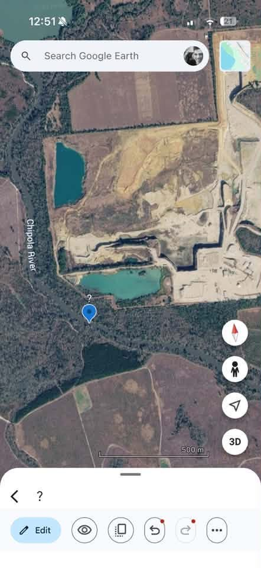
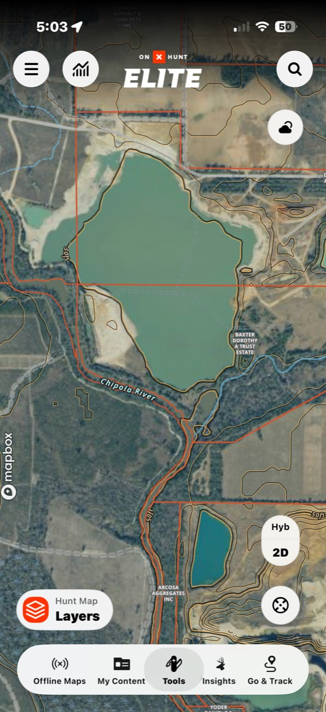
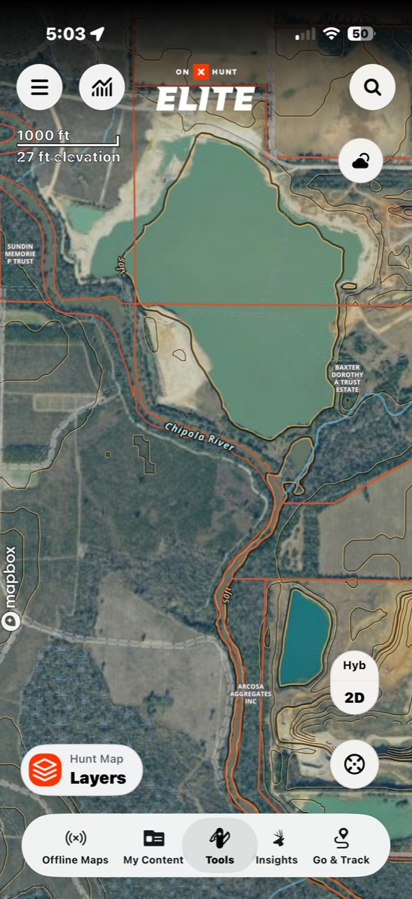

# Photo and site context

These screenshots were supplied by the user and prompted a deeper search for neighboring aggregate sources. They are useful visual context but are not surveys, legal parcel maps, time-stamped proof of a discharge, or measurements of the land bench.

## Google Earth overview

The view conveys the close physical juxtaposition of mine excavation/pit water and the wooded Chipola corridor. The southern edge of the water body appears separated from the channel by a narrow land/vegetation bench. The image alone does not establish its exact width, elevation, subsurface connectivity, ordinary high-water line, or whether water crossed it.

That visual concern is independently relevant to FDEP’s April 29, 2026 warning, which addressed road grading/disturbance inside the Chipola buffer, possible work beyond the permitted boundary, sovereign-submerged-lands concerns, and inadequate BMPs. The warning is stronger evidence than the screenshot for regulatory purposes.

## OnX property and neighboring-operation context

The screenshots identify an aggregate operation labeled Arcosa immediately downstream. That observation has now been corroborated with official records:

- North Florida Rock, now presented publicly as Arcosa Aggregates’ Marianna Pit, is regulated under industrial wastewater permit **FL0980722**, multisector stormwater coverage **FLR05I752**, and mining file **MMR_173508**.
- The [2019 wastewater permit](sources/33-FDEP-2019-Arcosa-North-Florida-Rock-NPDES-FL0980722.pdf) authorized D-001 to an intermittent creek/swallet route near the Chipola and D-002 to a tributary about 1,500 feet from the Chipola.
- FDEP’s March 2024 inspection found the swallet was no longer 45 feet from the river and “now has created a natural outfall also linked to the river.” The same inspection recorded GPS for the observed discharge point at about 30°38′09.2″ N, 85°10′16.3–16.9″ W.
- [FDEP’s facility record](sources/52-FDEP-Arcosa-FLR05I752-Facility-Report.html) for FLR05I752 describes a separate stormwater D-001 as “Outfall to CHIPOLA RIVER.”
- The July 2026 industrial DMR reports active D-001 flow and “MNR” for D-002.

The screenshots therefore led to a verified cumulative-source question. They do **not** prove that Arcosa contributed a pollutant load during the reported mortality or that the two facilities’ permitted discharges overlap at all times.

## What the permit record does and does not evaluate

It would be too broad to say that neither permit evaluates water quality. Arcosa’s 2019 permit contains a Level I water-quality-based-effluent-limit and antidegradation analysis and expressly addresses its two proposed discharges to/near the Outstanding Florida Water. Dolomite’s current permit also contains a water-quality analysis.

The narrower, supportable concern is this: **Dolomite’s 2012 biological study did not include Arcosa and was designed around Dolomite D-001, and the records reviewed here do not establish a current, reach-scale cumulative field study bracketing both aggregate operations.** That is the analysis Riverkeeper should request.

## Image limitations and reuse notice

- App boundaries, labels, contours, and imagery dates can be incomplete or stale.
- Apparent distances in a tilted, cropped, or screen-scaled image are not measurements.
- Current overlays do not establish 2012 or 2015 ownership.
- Aerial water color is affected by season, depth, sediment, sun angle, and image processing.
- Screenshots are reproduced here for public-interest research and commentary. Underlying Google Earth, OnX, Mapbox, parcel, and imagery rights remain with their respective owners.

The original image hashes are preserved in [assets/site-context/SHA256SUMS.txt](assets/site-context/SHA256SUMS.txt).
